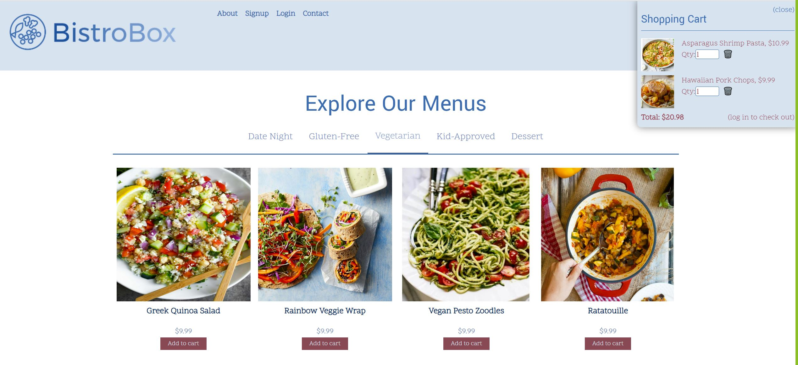

# BistroBox

## Table of Contents
- [Description](#description)
- [Installation](#installation)
- [Usage](#usage)
- [License](#license)
- [Creators](#Creators)

---

## Description

This app is similar to other meal box services in that you pick meals that you will cook at home. It is unique because we sell our meals per serving instead of being locked into 2 or 4 servings. We also offer dessert choices that are single serving mug cakes. Choose as many or as few servings of each meal as you need!

---

## Installation

To install this application on your local computer, you will need to clone the repository from GitHub onto your local computer. You will need to `run npm i` to install all the modules. The application requires the following module packages: REACT, Express.js, MongoDB, Node.js, Mongoose and Apollo Client. After you install the modules, run npm run seed in your terminal. After you have installed the modules and have the seeds running then enter run `npm run develop` into your terminal. 

---

## Usage

This application will be run from Heroku at the following URL:

[BistroBox](https://bistro-box.herokuapp.com/)

When you open BistroBox site click on your meal selection and that will take you to a product description. When you are on that page you can add however many meals you want to your cart. Once you have completed your order you can click on the shopping cart and enter your credit card information to purchase your items. While shopping you can leave a review and see our customers reviews!

---

## Technologies Used

#### Applications

- [REACT](https://reactjs.org/)
- [Express.js](https://expressjs.com/en/starter/installing.html)
- [MongoDB](https://www.mongodb.com/)
- [Mongoose](https://mongoosejs.com/)
- [Node.js](https://nodejs.org/en/)
- [Apollo](https://www.apollographql.com/docs/react/)
- [Heroku](https://mysterious-wildwood-15275.herokuapp.com/)

#### Sites

- [Heroku](https://bistro-box.herokuapp.com/)

- [REPO](https://github.com/charliebear2000/BistroBox)

---

## License

MIT License

For more information about this license go to: [MIT License](http://choosealicense.com/licenses/mit/)

---

## Screenshots

---

---

## Creators

- Amy Rawls
    - GitHub: [charliebear2000](https://github.com/charliebear2000)
    - :mailbox_with_mail: email: amyrawls@yahoo.com
- Ashley Walker
    - GitHub: [lawalker4](https://github.com/lawalker4)
    - :mailbox_with_mail: email: lauraashleywalker4@gmail.com 
- Chris Porter
    - GitHub: [ChrisPorter87](https://github.com/ChrisPorter87)
    - :mailbox_with_mail: email: cap8095@gmail.com 
- Courtney Koehler
    - GitHub: [ckoehler16](https://github.com/ckoehler16)
    - :mailbox_with_mail: email: ckoehler16@gmail.com

  Please contact us with any questions you might have.